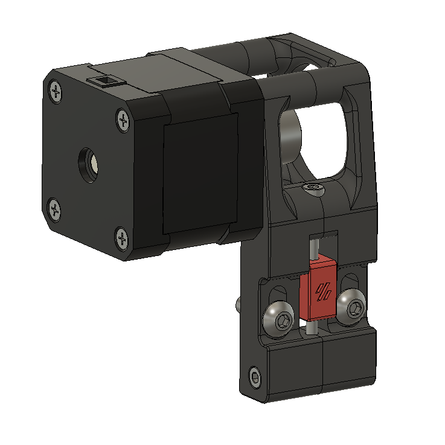
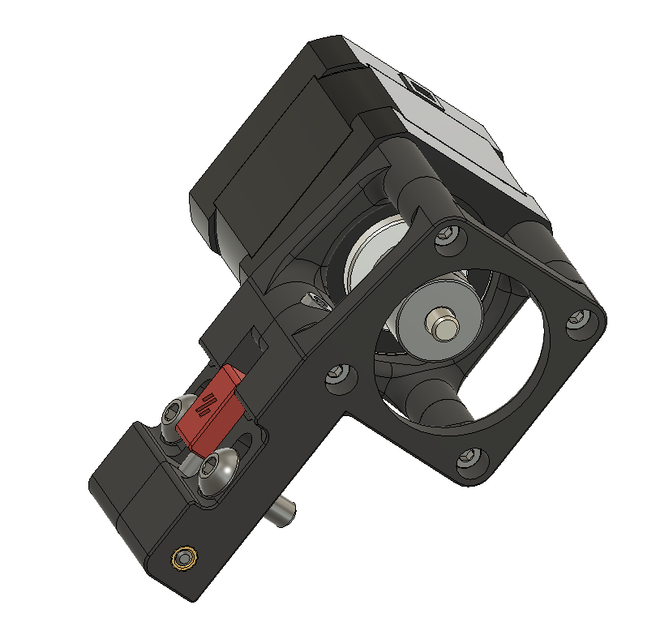
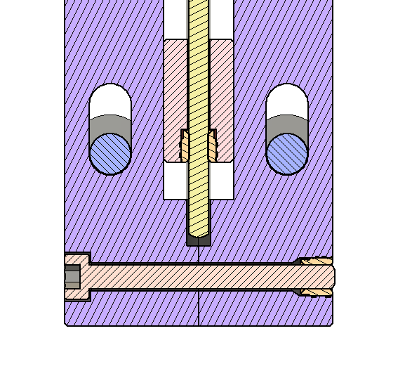

SwitchWire Stronger XZ Motor Mounts
==========================================

These are modified XZ motor mounts for VORON SwitchWire to add strength with a bolt at the bottom conneting the two halves. I found that the bottom of the mounts were seperating and weaking the entire mount. So I added a bolt and heat insert to keep it together. I have found this to help a lot.

Print using standard VORON print settings.  You'll need the same 2 heatset inserts and 2 M3x30 SHCS screws as used in the rest of the motor mount.

See how to assemble. The M3x4 heat insert goes on the back side and the M3x30 bolt comes from the front.

