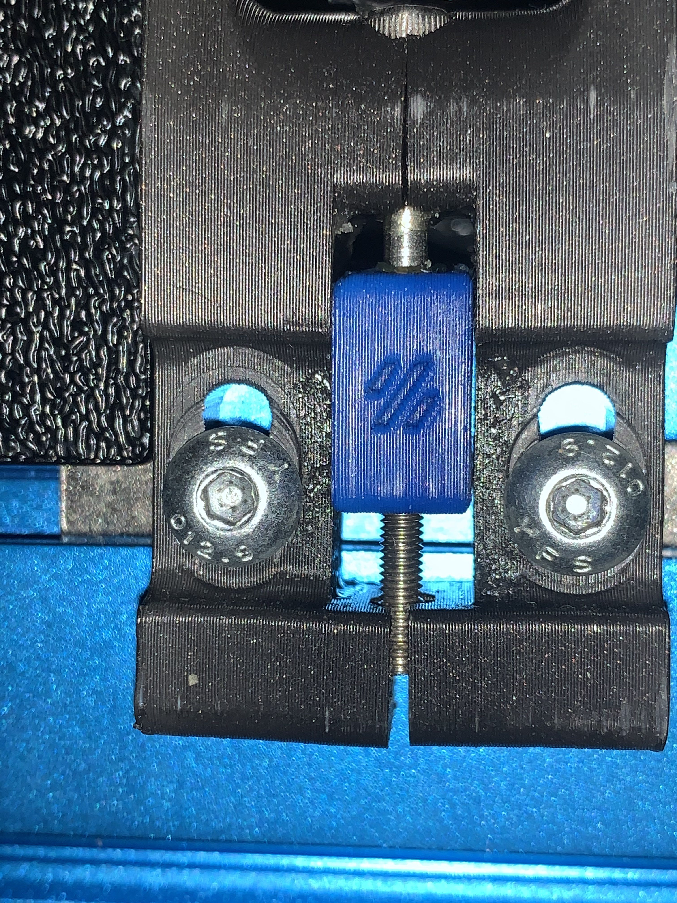

SwitchWire Stronger XZ Motor Mounts
==========================================

These are modified XZ motor mounts for VORON SwitchWire to add strength with a bolt at the bottom conneting the two halves.

Print using standard VORON print settings.  You'll need 2 heatset inserts and 2 M3x30 SHCS screws, the same as used in the rest of the motor mount.

Cross section showing how to assemble. The M3x4 heat insert goes on the back side and the M3x30 bolt comes from the front.

==========================================

Original design could have the bottom of the mounts seperate and weaken the entire mount.

